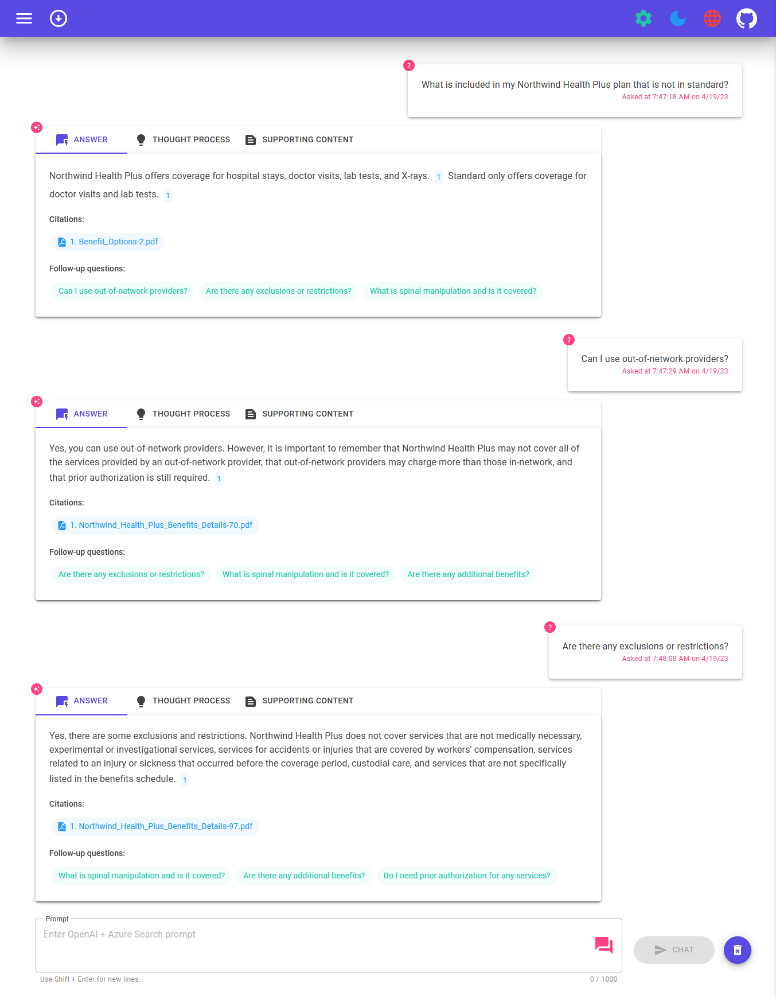

# ChatGPT + Enterprise data with Azure OpenAI and Cognitive Search


[](https://github.com/codespaces/new?hide_repo_select=true&ref=main&repo=624102171&machine=standardLinux32gb&devcontainer_path=.devcontainer%2Fdevcontainer.json&location=WestUs2)
[](https://vscode.dev/redirect?url=vscode://ms-vscode-remote.remote-containers/cloneInVolume?url=https://github.com/azure-samples/azure-search-openai-demo-csharp)

This sample demonstrates a few approaches for creating ChatGPT-like experiences over your own data using the Retrieval Augmented Generation pattern. It uses Azure OpenAI Service to access the ChatGPT model (`gpt-35-turbo`), and Azure Cognitive Search for data indexing and retrieval.

The repo includes sample data so it's ready to try end-to-end. In this sample application, we use a fictitious company called Contoso Electronics, and the experience allows its employees to ask questions about the benefits, internal policies, as well as job descriptions and roles.


For more details on how this application was built, check out:

- [Transform your business with smart .NET apps powered by Azure and ChatGPT blog post](https://aka.ms/build-dotnet-ai-blog)
- [Build Intelligent Apps with .NET and Azure - Build Session](https://build.microsoft.com/sessions/f8f953f3-2e58-4535-92ae-5cb30ef2b9b0)

We want to hear from you! Are you interested in building or currently building intelligent apps? Take a few minutes to complete this survey.

[**Take the survey**](https://aka.ms/dotnet-build-oai-survey)

## Features

* Voice Chat, Chat and Q&A interfaces
* Explores various options to help users evaluate the trustworthiness of responses with citations, tracking of source content, etc.
* Shows possible approaches for data preparation, prompt construction, and orchestration of interaction between model (ChatGPT) and retriever (Cognitive Search)
* Settings directly in the UX to tweak the behavior and experiment with options



## Getting Started

> **Note**<br>
> In order to deploy and run this example, you'll need an **Azure subscription with access enabled for the Azure OpenAI service**. You can request access [here](https://aka.ms/oaiapply). You can also visit [here](https://azure.microsoft.com/free/cognitive-search/) to get some free Azure credits to get you started.

> **Warning**<br>
> By default this sample will create an Azure App Service, Azure Static Web App, and Azure Cognitive Search resource that have a monthly cost, as well as Form Recognizer resource that has cost per document page. You can switch them to free versions of each of them if you want to avoid this cost by changing the parameters file under the infra folder (though there are some limits to consider; for example, you can have up to 1 free Cognitive Search resource per subscription, and the free Form Recognizer resource only analyzes the first 2 pages of each document.)

### Prerequisites

#### To Run Locally

- [Azure Developer CLI](https://aka.ms/azure-dev/install)
- [.NET 7](https://dotnet.microsoft.com/download)
- [Git](https://git-scm.com/downloads)
- [Powershell 7+ (pwsh)](https://github.com/powershell/powershell) - For Windows users only.
   - **Important**: Ensure you can run `pwsh.exe` from a PowerShell command. If this fails, you likely need to upgrade PowerShell.
- [Docker](https://www.docker.com/products/docker-desktop/)
  - **Important**: Ensure Docker is running before running any `azd` provisioning / deployment commands.

> **Note**<br>
> Your Azure Account must have `Microsoft.Authorization/roleAssignments/write` permissions, such as [User Access Administrator](https://learn.microsoft.com/azure/role-based-access-control/built-in-roles#user-access-administrator) or [Owner](https://learn.microsoft.com/azure/role-based-access-control/built-in-roles#owner).

#### To Run in GitHub Codespaces or VS Code Remote Containers

You can run this repo virtually by using GitHub Codespaces or VS Code Remote Containers.  Click on one of the buttons below to open this repo in one of those options.

[](https://github.com/codespaces/new?hide_repo_select=true&ref=main&repo=624102171&machine=standardLinux32gb&devcontainer_path=.devcontainer%2Fdevcontainer.json&location=WestUs2)
[](https://vscode.dev/redirect?url=vscode://ms-vscode-remote.remote-containers/cloneInVolume?url=https://github.com/azure-samples/azure-search-openai-demo-csharp)

### Installation

#### Project Initialization

1. Create a new folder and switch to it in the terminal
1. Run `azd auth login`
1. Run `azd init -t azure-search-openai-demo-csharp`
    * For the target location, the regions that currently support the models used in this sample are **East US** or **South Central US**. For an up-to-date list of regions and models, check [here](https://learn.microsoft.com/azure/cognitive-services/openai/concepts/models)

#### Starting from scratch

Execute the following command, if you don't have any pre-existing Azure services and want to start from a fresh deployment.

1. Run `azd up` - This will provision Azure resources and deploy this sample to those resources, including building the search index based on the files found in the `./data` folder.

> **Note**<br>
> This application uses the `text-davinci-003` and `gpt-35-turbo` models. When choosing which region to deploy to, make sure they're available in that region (i.e. EastUS). For more information, see the [Azure OpenAI Service documentation](https://learn.microsoft.com/en-us/azure/cognitive-services/openai/concepts/models#gpt-3-models-1).  

1. After the application has been successfully deployed you will see a URL printed to the console.  Click that URL to interact with the application in your browser.  

It will look like the following:


> **Note**<br>
> It may take a few minutes for the application to be fully deployed.

#### Use existing resources

1. Run `azd env set AZURE_OPENAI_SERVICE {Name of existing OpenAI service}`
1. Run `azd env set AZURE_OPENAI_RESOURCE_GROUP {Name of existing resource group that OpenAI service is provisioned to}`
1. Run `azd env set AZURE_OPENAI_CHATGPT_DEPLOYMENT {Name of existing ChatGPT deployment}`. Only needed if your ChatGPT deployment is not the default 'chat'.
1. Run `azd env set AZURE_OPENAI_GPT_DEPLOYMENT {Name of existing GPT deployment}`. Only needed if your ChatGPT deployment is not the default `davinci`.
1. Run `azd up`

> NOTE: You can also use existing Search and Storage Accounts.  See `./infra/main.parameters.json` for list of environment variables to pass to `azd env set` to configure those existing resources.

#### Deploying or re-deploying a local clone of the repo

* Run `azd up`

#### Deploying your repo using App Spaces

> **Note**<br>
> Make sure you have AZD supported bicep files in your repository and add an initial GitHub Actions Workflow file which can either be triggered manually (for initial deployment) or on code change (automatically re-deploying with the latest changes)
> To make your repository compatible with App Spaces, you need to make changes to your main bicep and main parameters file to allow AZD to deploy to an existing resource group with the appropriate tags.

1. Add AZURE_RESOURCE_GROUP to main parameters file to read the value from environment variable set in GitHub Actions workflow file by App Spaces.
   ```json
   "resourceGroupName": {
      "value": "${AZURE_RESOURCE_GROUP}"
    }
2. Add AZURE_TAGS to main parameters file to read the value from environment variable set in GitHub Actions workflow file by App Spaces.
   ```json
   "tags": {
      "value": "${AZURE_TAGS}"
    }
3. Add support for resource group and tags in your main bicep file to read the value being set by App Spaces.
   ```bicep
   param resourceGroupName string = ''
   param tags string = ''
4. Combine the default tags set by Azd with those being set by App Spaces. Replace *tags initialization* in your main bicep file with the following - 
   ```bicep
   var baseTags = { 'azd-env-name': environmentName }
   var updatedTags = union(empty(tags) ? {} : base64ToJson(tags), baseTags)
   Make sure to use "updatedTags" when assigning "tags" to resource group created in your bicep file and update the other resources to use "baseTags" instead of "tags". For example - 
   ```json
   resource rg 'Microsoft.Resources/resourceGroups@2021-04-01' = {
     name: !empty(resourceGroupName) ? resourceGroupName : '${abbrs.resourcesResourceGroups}${environmentName}'
     location: location
     tags: updatedTags
   }

#### Running locally

1. Run `azd auth login`
1. After the application deploys, set the environment variable `AZURE_KEY_VAULT_ENDPOINT`. You can find the value in the *.azure/YOUR-ENVIRONMENT-NAME/.env* file or the Azure portal.
1. Run the following .NET CLI command to start the ASP.NET Core Minimal API server (client host):

    ```dotnetcli
    dotnet run --project ./app/backend/MinimalApi.csproj --urls=https://localhost:7181/
    ```

Navigate to <https://localhost:7181>, and test out the app.

#### Sharing Environments

Run the following if you want to give someone else access to the deployed and existing environment.

1. Install the [Azure CLI](https://learn.microsoft.com/cli/azure/install-azure-cli)
1. Run `azd init -t azure-search-openai-demo-csharp`
1. Run `azd env refresh -e {environment name}` - Note that they will need the azd environment name, subscription Id, and location to run this command - you can find those values in your `./azure/{env name}/.env` file.  This will populate their azd environment's .env file with all the settings needed to run the app locally.
1. Run `pwsh ./scripts/roles.ps1` - This will assign all of the necessary roles to the user so they can run the app locally.  If they do not have the necessary permission to create roles in the subscription, then you may need to run this script for them. Just be sure to set the `AZURE_PRINCIPAL_ID` environment variable in the azd .env file or in the active shell to their Azure Id, which they can get with `az account show`.

#### Clean up resources

Run `azd down`

### Quickstart

* In Azure: navigate to the Azure Static Web App deployed by `azd`. The URL is printed out when `azd` completes (as "Endpoint"), or you can find it in the Azure portal.
* When running locally, navigate to <https://localhost:7181> for the client app and <https://localhost:7181/swagger> for the Open API server page.

Once in the web app:

* On the **Voice Chat** page, select the voice settings dialog and configure text-to-speech preferences.
  * You can either type messages to interact with Blazor Clippy, or select the Speak toggle button to use speech-to-text as your input.
* Try different topics in **Chat** or **Ask Questions** context. For chat, try follow up questions, clarifications, ask to simplify or elaborate on answer, etc.
* Explore citations and sources
* Click on the "settings" icon to try different options, tweak prompts, etc.

## Resources

* [Revolutionize your Enterprise Data with ChatGPT: Next-gen Apps w/ Azure OpenAI and Cognitive Search](https://aka.ms/entgptsearchblog)
* [Azure Cognitive Search](https://learn.microsoft.com/azure/search/search-what-is-azure-search)
* [Azure OpenAI Service](https://learn.microsoft.com/azure/cognitive-services/openai/overview)
* [`Azure.AI.OpenAI` NuGet package](https://www.nuget.org/packages/Azure.AI.OpenAI)
* [Original Blazor App](https://github.com/IEvangelist/blazor-azure-openai)

> **Note**<br>
> The PDF documents used in this demo contain information generated using a language model (Azure OpenAI Service). The information contained in these documents is only for demonstration purposes and does not reflect the opinions or beliefs of Microsoft. Microsoft makes no representations or warranties of any kind, express or implied, about the completeness, accuracy, reliability, suitability or availability with respect to the information contained in this document. All rights reserved to Microsoft.

### FAQ

***Question***: Why do we need to break up the PDFs into chunks when Azure Cognitive Search supports searching large documents?

***Answer***: Chunking allows us to limit the amount of information we send to OpenAI due to token limits. By breaking up the content, it allows us to easily find potential chunks of text that we can inject into OpenAI. The method of chunking we use leverages a sliding window of text such that sentences that end one chunk will start the next. This allows us to reduce the chance of losing the context of the text.
