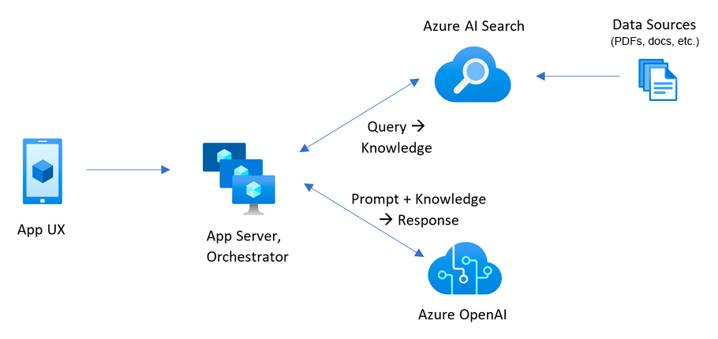

<!-- YAML front-matter schema: https://review.learn.microsoft.com/en-us/help/contribute/samples/process/onboarding?branch=main#supported-metadata-fields-for-readmemd -->

## Table of Contents

- [Features](#features)
- [Application Architecture](#application-architecture)
- [Azure account requirements](#account-requirements)
- [Getting Started](#getting-started)
  - [Cost estimation](#cost-estimation)
  - [Project setup](#project-setup)
    - [GitHub Codespaces](#github-codespaces)
    - [VS Code Dev Containers](#vs-code-remote-containers)
    - [Local environment](#local-environment)
  - [Deployment](#deployment)
    - [Deploying from scratch](#deploying-from-scratch)
    - [Deploying with existing Azure resources](#use-existing-resources)
    - [Deploying again](#deploying-or-re-deploying-a-local-clone-of-the-repo)
    - [Deploying App Spaces](#deploying-your-repo-using-app-spaces)
    - [Running locally](#running-locally)
    - [Sharing environments](#sharing-environments)
    - [Clean up resources](#clean-up-resources)
  - [Using the app](#using-the-app)
- [Enabling optional features](#enabling-optional-features)
  - [Enabling Application Insights](#enabling-optional-features)
  - [Enabling authentication](#enabling-authentication)
  - [Enable GPT-4V support](#enable-gpt-4v-support)
- [Guidance](#guidance) 
  - [Productionizing](#productionizing)
  - [Resources](#resources)
  - [FAQ](#faq)

# ChatGPT + Enterprise data with Azure OpenAI and Azure AI Search (.NET)


[](https://github.com/codespaces/new?hide_repo_select=true&ref=main&repo=624102171&machine=standardLinux32gb&devcontainer_path=.devcontainer%2Fdevcontainer.json&location=WestUs2)
[](https://vscode.dev/redirect?url=vscode://ms-vscode-remote.remote-containers/cloneInVolume?url=https://github.com/azure-samples/azure-search-openai-demo-csharp)

This sample demonstrates a few approaches for creating ChatGPT-like experiences over your own data using the Retrieval Augmented Generation pattern. It uses Azure OpenAI Service to access the ChatGPT model (`gpt-4o-mini`), and Azure AI Search for data indexing and retrieval.

The repo includes sample data so it's ready to try end-to-end. In this sample application, we use a fictitious company called Contoso Electronics, and the experience allows its employees to ask questions about the benefits, internal policies, as well as job descriptions and roles.



For more details on how this application was built, check out:

- [Transform your business with smart .NET apps powered by Azure and ChatGPT blog post](https://aka.ms/build-dotnet-ai-blog)
- [Build Intelligent Apps with .NET and Azure - Build Session](https://build.microsoft.com/sessions/f8f953f3-2e58-4535-92ae-5cb30ef2b9b0)

We want to hear from you! Are you interested in building or currently building intelligent apps? Take a few minutes to complete this survey.

[**Take the survey**](https://aka.ms/dotnet-build-oai-survey)

## Features

- Voice Chat, Chat and Q&A interfaces
- Explores various options to help users evaluate the trustworthiness of responses with citations, tracking of source content, etc.
- Shows possible approaches for data preparation, prompt construction, and orchestration of interaction between model (ChatGPT) and retriever (Azure AI Search)
- Settings directly in the UX to tweak the behavior and experiment with options


## Application architecture

- **User interface** - The application’s chat interface is a [Blazor WebAssembly](https://learn.microsoft.com/aspnet/core/blazor/) application. This interface is what accepts user queries, routes request to the application backend, and displays generated responses.
- **Backend** - The application backend is an [ASP.NET Core Minimal API](https://learn.microsoft.com/aspnet/core/fundamentals/minimal-apis/overview). The backend hosts the Blazor static web application and what orchestrates the interactions among the different services. Services used in this application include:
   - [**Azure AI Search**](https://learn.microsoft.com/azure/search/search-what-is-azure-search) – indexes documents from the data stored in an Azure Storage Account. This makes the documents searchable using [vector search](https://learn.microsoft.com/azure/search/search-get-started-vector) capabilities. 
   - [**Azure OpenAI Service**](https://learn.microsoft.com/azure/ai-services/openai/overview) – provides the Large Language Models to generate responses. [Semantic Kernel](https://learn.microsoft.com/semantic-kernel/whatissk) is used in conjunction with the Azure OpenAI Service to orchestrate the more complex AI workflows.

## Getting Started

### Account Requirements

In order to deploy and run this example, you'll need

- **Azure Account** - If you're new to Azure, get an [Azure account for free](https://aka.ms/free) and you'll get some free Azure credits to get started.
- **Azure account permissions** - Your Azure Account must have `Microsoft.Authorization/roleAssignments/write` permissions, such as [User Access Administrator](https://learn.microsoft.com/azure/role-based-access-control/built-in-roles#user-access-administrator) or [Owner](https://learn.microsoft.com/azure/role-based-access-control/built-in-roles#owner).

> [!WARNING]<br>
> By default this sample will create an Azure Container App, and Azure AI Search resource that have a monthly cost, as well as Azure AI Document Intelligence resource that has cost per document page. You can switch them to free versions of each of them if you want to avoid this cost by changing the parameters file under the infra folder (though there are some limits to consider; for example, you can have up to 1 free Azure AI Search resource per subscription, and the free Azure AI Document Intelligence resource only analyzes the first 2 pages of each document.)

### Cost estimation

Pricing varies per region and usage, so it isn't possible to predict exact costs for your usage. However, you can try the [Azure pricing calculator](https://azure.microsoft.com/pricing/calculator/) for the resources below:

- [**Azure Container Apps**](https://azure.microsoft.com/pricing/details/container-apps/). Environment type: Consumption Only. The solution uses the Consumption plan, as we don't have specific hardware requirements.
- [**Azure OpenAI Service**](https://azure.microsoft.com/pricing/details/cognitive-services/openai-service/). Standard tier, GPT and Ada models. Pricing per 1K tokens used, and at least 1K tokens are used per question. 
- [**Azure AI Document Intelligence**](https://azure.microsoft.com/pricing/details/ai-document-intelligence/). SO (Standard) tier using pre-built layout. Pricing per document page, sample documents have 261 pages total.
- [**Azure AI Search**](https://azure.microsoft.com/pricing/details/search/) Basic tier, 1 replica, free level of semantic search. Pricing per hour.
- [**Azure Blob Storage**](https://azure.microsoft.com/pricing/details/storage/blobs/). Standard tier with ZRS (Zone-redundant storage). Pricing per storage and read operations. 
- [**Azure Monitor**](https://azure.microsoft.com/pricing/details/monitor/). Pay-as-you-go tier. Costs based on data ingested.

To reduce costs, you can switch to free SKUs for various services, but those SKUs have limitations. See this [guide on deploying with minimal costs](./docs/deploy_lowcost.md) for more details.

⚠️ To avoid unnecessary costs, remember to take down your app if it's no longer in use, either by deleting the resource group in the Portal or running `azd down`.

### Project setup

You have a few options for setting up this project. The easiest way to get started is GitHub Codespaces, since it will setup all the tools for you, but you can also set it up [locally](#local-environment) if desired.

#### GitHub Codespaces

You can run this repo virtually by using GitHub Codespaces, which will open a web-based VS Code in your browser:

[](https://github.com/codespaces/new?hide_repo_select=true&ref=main&repo=624102171&machine=standardLinux32gb&devcontainer_path=.devcontainer%2Fdevcontainer.json&location=WestUs2)

#### VS Code Remote Containers

A related option is VS Code Remote Containers, which will open the project in your local VS Code using the [Dev Containers](https://marketplace.visualstudio.com/items?itemName=ms-vscode-remote.remote-containers) extension:

[](https://vscode.dev/redirect?url=vscode://ms-vscode-remote.remote-containers/cloneInVolume?url=https://github.com/azure-samples/azure-search-openai-demo-csharp)

#### Local environment

Install the following prerequisites:

- [Azure Developer CLI](https://aka.ms/azure-dev/install)
- [.NET 8](https://dotnet.microsoft.com/download/dotnet/8.0)
- [Git](https://git-scm.com/downloads)
- [Powershell 7+ (pwsh)](https://github.com/powershell/powershell) - For Windows users only.
  
   > **Important**: 
   > Ensure you can run `pwsh.exe` from a PowerShell command. If this fails, you likely need to upgrade PowerShell.

- [Docker](https://www.docker.com/products/docker-desktop/)

   > **Important**:
   > Ensure Docker is running before running any `azd` provisioning / deployment commands.

Then, run the following commands to get the project on your local environment:

   1. Run `azd auth login`
   1. Clone the repository or run `azd init -t azure-search-openai-demo-csharp`
   1. Run `azd env new azure-search-openai-demo-csharp`

### Deployment

#### Deploying from scratch

[📺 Live stream: Deploying from scratch in CodeSpaces](https://youtu.be/TORUsRNimM0)
[📺 Live stream: Deploying from scratch in Windows 11](https://youtu.be/wgSnkxGH2Sk?si=C4zAbLKhK3LoAS43)

> **Important**:
> Ensure Docker is running before running any `azd` provisioning / deployment commands.

Execute the following command, if you don't have any pre-existing Azure services and want to start from a fresh deployment.

1. Run `azd up` - This will provision Azure resources and deploy this sample to those resources, including building the search index based on the files found in the `./data` folder.
   - For the target location, the regions that currently support the model used in this sample are **East US**. For an up-to-date list of regions and models, check [here](https://learn.microsoft.com/azure/cognitive-services/openai/concepts/models)
   - If you have access to multiple Azure subscriptions, you will be prompted to select the subscription you want to use. If you only have access to one subscription, it will be selected automatically.

   > **Note**:
   > This application uses the `gpt-4o-mini` model. When choosing which region to deploy to, make sure they're available in that region (i.e. EastUS). For more information, see the [Azure OpenAI Service documentation](https://learn.microsoft.com/en-us/azure/ai-services/openai/concepts/models#standard-deployment-model-availability).

1. After the application has been successfully deployed you will see a URL printed to the console. Click that URL to interact with the application in your browser.

It will look like the following:


> [!NOTE]:
> It may take a few minutes for the application to be fully deployed.
> After the application is deployed, it will also take a few minutes to process the documents to be added into the vector database.

#### Use existing resources

If you have existing resources in Azure that you wish to use, you can configure `azd` to use those by setting the following `azd` environment variables:

1. Run `azd env set AZURE_OPENAI_SERVICE {Name of existing OpenAI service}`
1. Run `azd env set AZURE_OPENAI_RESOURCE_GROUP {Name of existing resource group that OpenAI service is provisioned to}`
1. Run `azd env set AZURE_OPENAI_CHATGPT_DEPLOYMENT {Name of existing ChatGPT deployment}`. Only needed if your ChatGPT deployment is not the default 'chat'.
1. Run `azd env set AZURE_OPENAI_EMBEDDING_DEPLOYMENT {Name of existing embedding model deployment}`. Only needed if your embedding model deployment is not the default `embedding`.
1. Run `azd up`

> [!NOTE]<br> 
> You can also use existing Search and Storage Accounts. See `./infra/main.parameters.json` for list of environment variables to pass to `azd env set` to configure those existing resources.

#### Deploying or re-deploying a local clone of the repo

> [!IMPORTANT]<br>
> Ensure Docker is running before running any `azd` provisioning / deployment commands.

- Run `azd up`

#### Deploying your repo using App Spaces

> [!NOTE]<br>
> Make sure you have AZD supported bicep files in your repository and add an initial GitHub Actions Workflow file which can either be triggered manually (for initial deployment) or on code change (automatically re-deploying with the latest changes)
> To make your repository compatible with App Spaces, you need to make changes to your main bicep and main parameters file to allow AZD to deploy to an existing resource group with the appropriate tags.

1. Add AZURE_RESOURCE_GROUP to main parameters file to read the value from environment variable set in GitHub Actions workflow file by App Spaces.
   ```json
   "resourceGroupName": {
      "value": "${AZURE_RESOURCE_GROUP}"
    }
   ```
2. Add AZURE_TAGS to main parameters file to read the value from environment variable set in GitHub Actions workflow file by App Spaces.
   ```json
   "tags": {
      "value": "${AZURE_TAGS}"
    }
   ```
3. Add support for resource group and tags in your main bicep file to read the value being set by App Spaces.
   ```bicep
   param resourceGroupName string = ''
   param tags string = ''
   ```
4. Combine the default tags set by Azd with those being set by App Spaces. Replace _tags initialization_ in your main bicep file with the following -
   ````bicep
   var baseTags = { 'azd-env-name': environmentName }
   var updatedTags = union(empty(tags) ? {} : base64ToJson(tags), baseTags)
   Make sure to use "updatedTags" when assigning "tags" to resource group created in your bicep file and update the other resources to use "baseTags" instead of "tags". For example -
   ```json
   resource rg 'Microsoft.Resources/resourceGroups@2021-04-01' = {
     name: !empty(resourceGroupName) ? resourceGroupName : '${abbrs.resourcesResourceGroups}${environmentName}'
     location: location
     tags: updatedTags
   }
   ````

#### Running locally

> [!IMPORTANT]<br>
> Ensure Docker is running before running any `azd` provisioning / deployment commands.

1. Run `azd auth login`
1. After the application deploys, set the environment variable `AZURE_KEY_VAULT_ENDPOINT`. You can find the value in the _.azure/YOUR-ENVIRONMENT-NAME/.env_ file or the Azure portal.
1. Run the following .NET CLI command to start the ASP.NET Core Minimal API server (client host):

   ```dotnetcli
   dotnet run --project ./app/backend/MinimalApi.csproj --urls=http://localhost:7181/
   ```

Navigate to <http://localhost:7181>, and test out the app.

#### Running locally with the .NET MAUI client

This sample includes a .NET MAUI client, packaging the experience as an app that can run on a Windows/macOS desktop or on Android and iOS devices. The MAUI client here is implemented using Blazor hybrid, letting it share most code with the website frontend.

1. Open _app/app-maui.sln_ to open the solution that includes the MAUI client

1. Edit _app/maui-blazor/MauiProgram.cs_, updating `client.BaseAddress` with the URL for the backend.

   If it's running in Azure, use the URL for the service backend from the steps above. If running locally, use <http://localhost:7181>.

1. Set **MauiBlazor** as the startup project and run the app

#### Sharing Environments

Run the following if you want to give someone else access to the deployed and existing environment.

1. Install the [Azure CLI](https://learn.microsoft.com/cli/azure/install-azure-cli)
1. Run `azd init -t azure-search-openai-demo-csharp`
1. Run `azd env refresh -e {environment name}` - Note that they will need the azd environment name, subscription Id, and location to run this command - you can find those values in your `./azure/{env name}/.env` file. This will populate their azd environment's .env file with all the settings needed to run the app locally.
1. Run `pwsh ./scripts/roles.ps1` - This will assign all of the necessary roles to the user so they can run the app locally. If they do not have the necessary permission to create roles in the subscription, then you may need to run this script for them. Just be sure to set the `AZURE_PRINCIPAL_ID` environment variable in the azd .env file or in the active shell to their Azure Id, which they can get with `az account show`.

#### Clean up resources

Run `azd down`

### Using the app

- In Azure: navigate to the Azure Container App deployed by `azd`. The URL is printed out when `azd` completes (as "Endpoint"), or you can find it in the Azure portal.
- When running locally, navigate to <http://localhost:7181> for the client app and <http://localhost:7181/swagger> for the Open API server page.

Once in the web app:

- On the **Voice Chat** page, select the voice settings dialog and configure text-to-speech preferences.
  - You can either type messages to interact with Blazor Clippy, or select the Speak toggle button to use speech-to-text as your input.
- Try different topics in **Chat** context. For chat, try follow up questions, clarifications, ask to simplify or elaborate on answer, etc.
- Explore citations and sources
- Click on the "settings" icon to try different options, tweak prompts, etc.

## Enabling optional features

### Enabling Application Insights

To enable Application Insights and the tracing of each request, along with the logging of errors, set the `AZURE_USE_APPLICATION_INSIGHTS` variable to true before running `azd up`

1. Run `azd env set AZURE_USE_APPLICATION_INSIGHTS true`
1. Run `azd up`

To see the performance data, go to the Application Insights resource in your resource group, click on the "Investigate -> Performance" blade and navigate to any HTTP request to see the timing data.
To inspect the performance of chat requests, use the "Drill into Samples" button to see end-to-end traces of all the API calls made for any chat request:


To see any exceptions and server errors, navigate to the "Investigate -> Failures" blade and use the filtering tools to locate a specific exception. You can see Python stack traces on the right-hand side.

### Enabling authentication

By default, the deployed Azure container app will have no authentication or access restrictions enabled, meaning anyone with routable network access to the container app can chat with your indexed data.  You can require authentication to your Azure Active Directory by following the [Add container app authentication](https://learn.microsoft.com/azure/container-apps/authentication-azure-active-directory) tutorial and set it up against the deployed container app.

To then limit access to a specific set of users or groups, you can follow the steps from [Restrict your Azure AD app to a set of users](https://learn.microsoft.com/azure/active-directory/develop/howto-restrict-your-app-to-a-set-of-users) by changing "Assignment Required?" option under the Enterprise Application, and then assigning users/groups access.  Users not granted explicit access will receive the error message -AADSTS50105: Your administrator has configured the application <app_name> to block users unless they are specifically granted ('assigned') access to the application.-

### Enable vision (multi-modal) support

With `GPT-4o-mini`, it's possible to support an enrichmented retrival augmented generation by providing both text and image as source content. To enable vision support, you need to enable `USE_VISION` and use `GPT-4o` or `GPT-4o-mini` model when provisioning.

> [!NOTE]
> You would need to re-indexing supporting material and re-deploy the application after enabling GPT-4o support if you have already deployed the application before. This is because enabling GPT-4o support requires new fields to be added to the search index.

To enable GPT-4V support with Azure OpenAI Service, run the following commands:

```bash
azd env set USE_VISION true
azd env set USE_AOAI true
azd env set AZURE_OPENAI_CHATGPT_MODEL_NAME gpt-4o-mini
azd env set AZURE_OPENAI_RESOURCE_LOCATION eastus # Please check the gpt model availability for more details.
azd up
```

To enable vision support with OpenAI, run the following commands:

```bash
azd env set USE_VISION true
azd env set USE_AOAI false
azd env set OPENAI_CHATGPT_DEPLOYMENT gpt-4o
azd up
```

To clean up previously deployed resources, run the following command:

```bash
azd down --purge
azd env set AZD_PREPDOCS_RAN false # This is to ensure that the documents are re-indexed with the new fields.
```

## Guidance

Besides the tips below, you can find extensive documentation in the [docs](./docs) folder.

### Productionizing

This sample is designed to be a starting point for your own production application,
but you should do a thorough review of the security and performance before deploying
to production. Here are some things to consider:

- **OpenAI Capacity**: The default TPM (tokens per minute) is set to 30K. That is equivalent to approximately 30 conversations per minute (assuming 1K per user message/response). You can increase the capacity by changing the `chatGptDeploymentCapacity` and `embeddingDeploymentCapacity` parameters in `infra/main.bicep` to your account's maximum capacity. You can also view the Quotas tab in [Azure OpenAI studio](https://oai.azure.com/) to understand how much capacity you have.

- **Azure Storage**: The default storage account uses the `Standard_LRS` SKU. To improve your resiliency, we recommend using `Standard_ZRS` for production deployments, which you can specify using the `sku` property under the `storage` module in `infra/main.bicep`.

- **Azure AI Search**: If you see errors about search service capacity being exceeded, you may find it helpful to increase the number of replicas by changing `replicaCount` in `infra/core/search/search-services.bicep` or manually scaling it from the Azure Portal.

- **Azure Container Apps**: By default, this application deploys containers with 0.5 CPU Cores and 1GB of memory. The minimum replicas is 1 and maximum 10. For this app, you can set values such as `containerCpuCoreCount`, `containerMaxReplicas `, `containerMemory`, `containerMinReplicas` in the `infra/core/host/container-app.bicep` file to fit your needs. You can use auto-scaling rules or scheduled scaling rules, and scale up the [maximum/minimum](https://learn.microsoft.com/azure/container-apps/scale-app) based on load.

- **Authentication**: By default, the deployed app is publicly accessible. We recommend restricting access to authenticated users. See [Enabling authentication](#enabling-authentication) above for how to enable authentication.

- **Networking**: We recommend deploying inside a Virtual Network. If the app is only for internal enterprise use, use a private DNS zone. Also consider using Azure API Management (APIM) for firewalls and other forms of protection. For more details, read [Azure OpenAI Landing Zone reference architecture](https://techcommunity.microsoft.com/t5/azure-architecture-blog/azure-openai-landing-zone-reference-architecture/ba-p/3882102).

- **Loadtesting**: We recommend running a loadtest for your expected number of users.

### Resources

- [Revolutionize your Enterprise Data with ChatGPT: Next-gen Apps w/ Azure OpenAI and Azure AI Search](https://aka.ms/entgptsearchblog)
- [Azure AI Search](https://learn.microsoft.com/azure/search/search-what-is-azure-search)
- [Azure OpenAI Service](https://learn.microsoft.com/azure/cognitive-services/openai/overview)
- [`Azure.AI.OpenAI` NuGet package](https://www.nuget.org/packages/Azure.AI.OpenAI)
- [Original Blazor App](https://github.com/IEvangelist/blazor-azure-openai)

> [!NOTE]<br>
> The PDF documents used in this demo contain information generated using a language model (Azure OpenAI Service). The information contained in these documents is only for demonstration purposes and does not reflect the opinions or beliefs of Microsoft. Microsoft makes no representations or warranties of any kind, express or implied, about the completeness, accuracy, reliability, suitability or availability with respect to the information contained in this document. All rights reserved to Microsoft.

### FAQ

**_Question_**: Why do we need to break up the PDFs into chunks when Azure AI Search supports searching large documents?

**_Answer_**: Chunking allows us to limit the amount of information we send to OpenAI due to token limits. By breaking up the content, it allows us to easily find potential chunks of text that we can inject into OpenAI. The method of chunking we use leverages a sliding window of text such that sentences that end one chunk will start the next. This allows us to reduce the chance of losing the context of the text.
